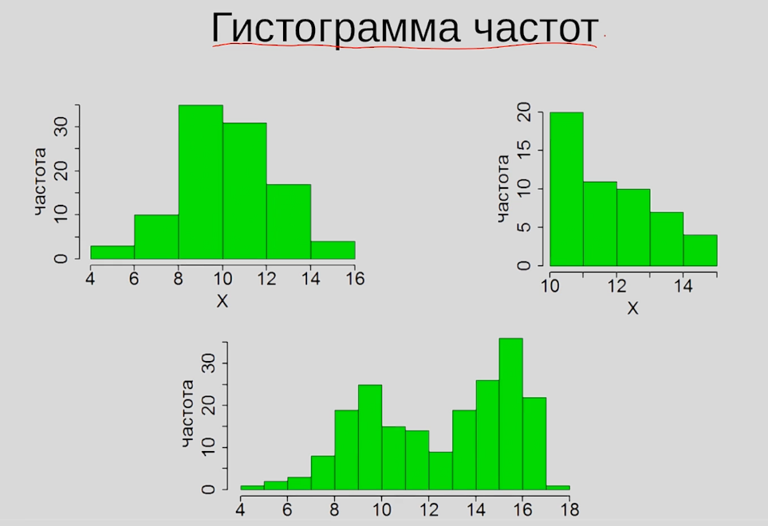
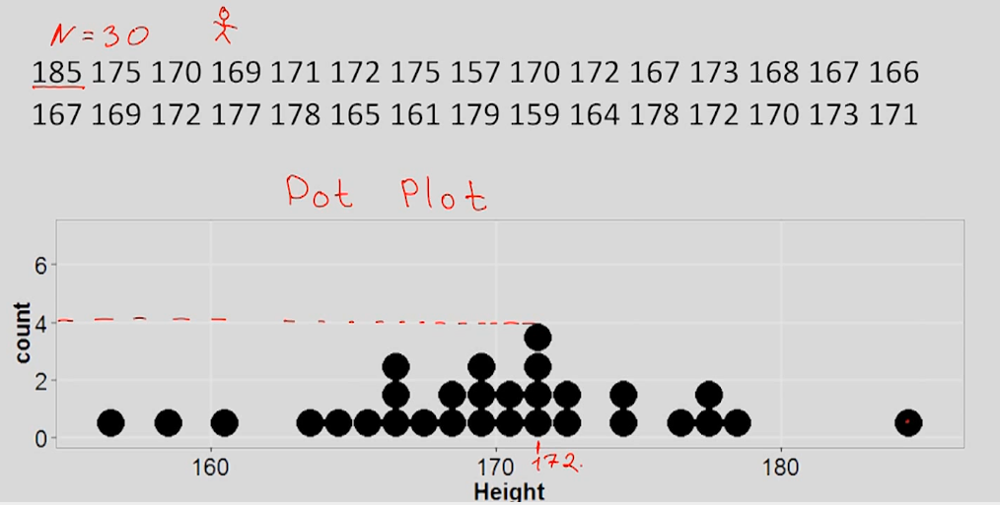
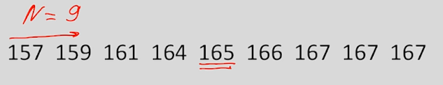
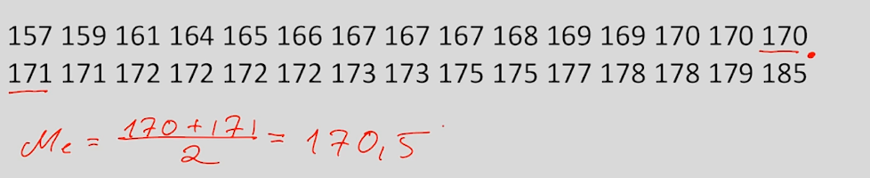

<!-- Пробел это знак "-", заглавные буквы нужно поменять на маленькие, "." пропускаем -->
<!-- cntrl + alt + v вставит картинку в папку img (настроенную в расшерении pastle image) -->
<!-- Ctrl+Shift+P -> Create Table of Contents - создание ссылки на заголовок -->
<!-- Ctrl+Shift+P -> Add/Update section numbers  - добавляет нумерацию заголовков -->

**Содержание**

- [1. Введение](#1-введение)
    - [1.1. Генеральная совокупность и выборка](#11-генеральная-совокупность-и-выборка)
    - [1.2. Типы переменных. Количественные и номинативные переменны](#12-типы-переменных-количественные-и-номинативные-переменны)
    - [Меры центральной тенденции](#меры-центральной-тенденции)

# 1. Введение
### 1.1. Генеральная совокупность и выборка

**Генеральная совокупность** - все объекты в рамках проблемы

**Выборка** - часть генеральной совокупности

**репрезентативность выборки** - чтобы выборка отражала свойства генеральной совокупности

Способы формирования репрезентативной выборки:
- простая случайная выборка
- стратифицированная выборка - разделить ген совокупность по признакам и выбор рандомных значений из каждой группы
- групповая выборка - разделить ген совокупность на группы похожие друг на друга и выбрать только несколько групп (например поделить город на регионы и выбрать 1 регион)

### 1.2. Типы переменных. Количественные и номинативные переменны

**Переменные:**
- Количественные (дискретные(число детей), непрерывные(рост))
- Качественные (номинативные)

Ещё можно добавить ранговые переменные - похоже на номинативную, но выражена количественно (например, номер человека в забеге). Их можно только сравнивать но нельзя выразить на сколько один показатель больше другого

### Меры центральной тенденции

как часто переменная x встречается на промежутке

Способы исследования распределения:
- Меры центральной тенденции
- Меры изменчивости

**мода** - самое часто встречающее значение

**медиана** - значение со средним порядков номером в упорядоченной по значению выборке (если нечётное количество, то берём среднее между двумя значениями по середине)

**среднее значение** - сумма/количество (оно чувствительно к выбросам)

свойства среднего: 

M - среднее
$$
\overline{X} = \frac{\sum_{i = 1}^n{X}}{n}
$$
$$
M_{x+c} = M_{x}+C
$$(1)
доказательство:
$$
M_{x+c} = \frac{\sum_{i = 1}^n{(X+C)}}{n} = 
    \frac{\sum_{i = 1}^n{X} + \sum_{i = 1}^n{C}}{n} =
    \frac{\sum_{i = 1}^n{X} + n C}{n}
$$
$$
= \frac{\sum_{i = 1}^n{X}}{n}  + C = M_x+C
$$

$$
M_{x git\cdot c}
$$