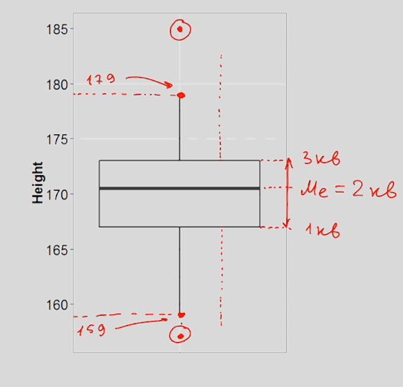
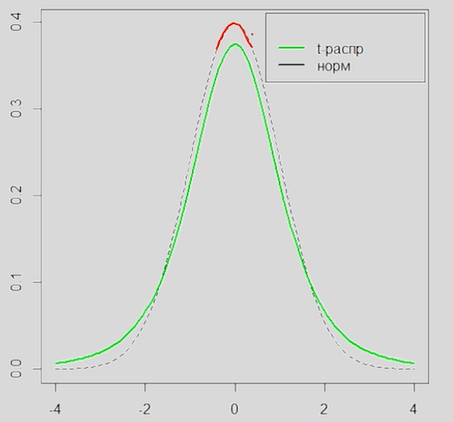
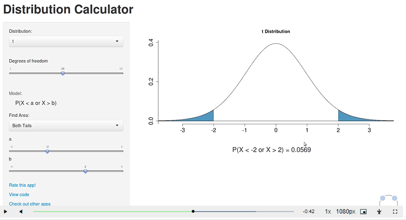
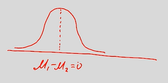

<!-- Пробел это знак "-", заглавные буквы нужно поменять на маленькие, "." пропускаем -->
<!-- cntrl + alt + v вставит картинку в папку img (настроенную в расшерении pastle image) -->
<!-- Ctrl+Shift+P -> Create Table of Contents - создание ссылки на заголовок -->
<!-- Ctrl+Shift+P -> Add/Update section numbers  - добавляет нумерацию заголовков -->

**Содержание**

- [1. Введение](#1-введение)
  - [1.1. Генеральная совокупность и выборка](#11-генеральная-совокупность-и-выборка)
  - [1.2. Типы переменных. Количественные и номинативные переменны](#12-типы-переменных-количественные-и-номинативные-переменны)
  - [1.3. Меры центральной тенденции](#13-меры-центральной-тенденции)
  - [1.4. Меры изменчивости](#14-меры-изменчивости)
  - [1.5. Квартили распределения и график box-plot](#15-квартили-распределения-и-график-box-plot)
  - [1.6. Нормальное распределение + z-распределение](#16-нормальное-распределение--z-распределение)
  - [1.7. Центральная предельная теорема](#17-центральная-предельная-теорема)
  - [1.8. Доверительные интервалы для среднего](#18-доверительные-интервалы-для-среднего)
  - [1.9. Идея статистического вывода, p-уровень значимости](#19-идея-статистического-вывода-p-уровень-значимости)
- [Сравнение средних](#сравнение-средних)
  - [T-распределение (распределение Стьюдента)](#t-распределение-распределение-стьюдента)
  - [Сравнение двух средних; t-критерий Стьюдента](#сравнение-двух-средних-t-критерий-стьюдента)

# 1. Введение
## 1.1. Генеральная совокупность и выборка

**Генеральная совокупность** - все объекты в рамках проблемы

**Выборка** - часть генеральной совокупности

**репрезентативность выборки** - чтобы выборка отражала свойства генеральной совокупности

Способы формирования репрезентативной выборки:
- простая случайная выборка
- стратифицированная выборка - разделить ген совокупность по признакам и выбор рандомные значений из каждой группы
- групповая выборка - разделить ген совокупность на группы похожие друг на друга и выбрать только несколько групп (например поделить город на регионы и выбрать 1 регион)

## 1.2. Типы переменных. Количественные и номинативные переменны

**Переменные:**
- Количественные (дискретные(число детей), непрерывные(рост))
- Качественные (номинативные)

Ещё можно добавить ранговые переменные - похоже на номинативную, но выражена количественно (например, номер человека в забеге). Их можно только сравнивать но нельзя выразить на сколько один показатель больше другого

## 1.3. Меры центральной тенденции

как часто переменная x встречается на промежутке

Способы исследования распределения:
- Меры центральной тенденции
- Меры изменчивости

**мода** - самое часто встречающее значение

**медиана** - значение со средним порядков номером в упорядоченной по значению выборке (если нечётное количество, то берём среднее между двумя значениями по середине)

**среднее значение** - сумма/количество (оно чувствительно к выбросам)

свойства среднего: 

M - среднее

$$
\overline{X} = \frac{\sum_{i = 1}^n{X_i}}{n} 
$$

___

$$
M_{x+c} = M_{x}+C \qquad (1)
$$  

Доказательство:

$$
M_{x+c} = \frac{\sum_{i = 1}^n{(X_i+C)}}{n} = 
    \frac{\sum_{i = 1}^n{X_i} + \sum_{i = 1}^n{C}}{n} =
    \frac{\sum_{i = 1}^n{X_i} + n C}{n}
$$

$$
= \frac{\sum_{i = 1}^n{X_i}}{n}  + C = M_x+C
$$

___

$$
M_{x \cdot c} = C M_x \qquad (2)
$$

Доказательство:

$$
M_{x \cdot c} = \frac{\sum_{i = 1}^n{CX}}{n} = \frac{C\sum_{i = 1}^n{X_i}}{n} = C M_x
$$

___

$$
\sum_{i=1}^{n}{(X_i-M_x)} = 0 \qquad (3)
$$

Доказательство:

$$
\sum_{i=1}^{n}{(X_i-M_x)} = \sum_{i=1}^{n}{X_i}-\sum_{i=1}^{n}{M_x} = \sum_{i=1}^{n}{X_i}-\sum_{i=1}^{n}{(\frac{\sum_{i = 1}^n{X}}{n} )} = 
$$

$$
= \sum_{i=1}^{n}{X_i}-n{(\frac{\sum_{i = 1}^n{X}}{n} )} = \sum_{i=1}^{n}{X_i} - \sum_{i=1}^{n}{X_i} = 0
$$

## 1.4. Меры изменчивости

**Размах**

$$
R = X_{max} - X_{min}
$$

- Зависит всего от двух значений

**Дисперсия** - среднее от квадратов отклонения x от x среднего

$$
D_{x} = \overline{(x_i - \overline{x})^2} = \frac{\sum{(x_i - \overline{x})^2}}{n}
$$

**Среднеквадратическое отклонение** - $\sqrt{D} = \sigma$

чтобы вернуться к исходныи единицам измерения взяли квадратный корень

есть 2 разных понятия:
- Среднеквадратическое отклонение генеральной совокупности - $\sigma$ (формула не меняется)
- Среднеквадратическое отклонение выборочной совокупности (стандартное отклонение) - sd (формула меняется)

Для выборочной совокупности вместо n берём n-1

скорректированная дисперсия ($sd^2$ или $S^2$):

$$
sd_x^2 = \frac{\sum{(x_i - \overline{x})^2}}{n-1}
$$

стандартное отклонение ($sd$ или $S$):

$$
sd_x = \sqrt{\frac{\sum{(x_i - \overline{x})^2}}{n-1}}
$$

И соответственно Среднеквадратическое отклонение тоже считается как корень из данной дисперсии

Свойства дисперсии:

$$
D_{x+c} = D \qquad (4)
$$

аналогично

$$
sd_{x+c} = sd \qquad (5) 
$$

Доказательство:

$$
D_{x+c} = \frac{\sum{(x_i+c - \overline{(x+c)})^2}}{n}
$$

$$
\overline{(x+c)} = \overline{x} + c \qquad \text{по свойству средних}
$$

$$
D_{x+c} = \frac{\sum{(x_i + c - (\overline{x} + c))^2}}{n} = \frac{\sum{(x_i - \overline{x})^2}}{n}
$$

аналогичное размышление для sd

___

$$
D_{x \cdot с} = D_xc^2 \qquad (6)
$$

$$
sd_{x \cdot с} = sd_xc \qquad (7)
$$

Доказательство:

$$
D_{x \cdot с} = \frac{\sum{(x_ic - \overline{(x_ic)})^2}}{n}
$$

$$
\overline{(x_ic)} = с\overline{x} \qquad \text{по свойству средних} 
$$

$$
D_{x \cdot с} = \frac{\sum{(cx_i - c\overline{x_i})^2}}{n} = \frac{\sum{(с \cdot (x_i - \overline{x_i}))^2}}{n} = \frac{\sum{c^2(x_i - \overline{x_i})^2}}{n} = \frac{c^2\sum{(x_i - \overline{x_i})^2}}{n} = 
$$

$$
 = c^2D_x
$$

Так как sd - корень из скорректированной дисперсии, то от $c^2$ тоже возьмётся корень и получиться C. поэтому $sd_{x \cdot с} = sd_xc$

## 1.5. Квартили распределения и график box-plot

Квантили делят упорядоченные данные на несколько равных частей

Квартили делят значения на 4 части

квартиль - значение признака

пример [1,5,6,7,9] 1 квартиль это медиана значений слева от медианы (6) - медиана для [1,5] = (1+5)/2 = 3

Медиана - второй квартиль

box-plot - график где прямоугольник - между 1 и 3 квартилем и 2 линии (ещё 1,5 межквартальных размаха (IQR) (разность значений 1 и 3 квартиля) от краёв прямоугольника)\
То, что заходит за линии помечается отдельными точками

между 1 и 3 квартилем располагается 50% выборки

нарисовав box-plot для каждой из групп можно сравнить распределения по изменчивости

????? почему усы на картинке разного размера так и не понял. Походу картинка с ошибкой

усы по идее могут быть разными только если усы перуться от минимального до максимального значения

## 1.6. Нормальное распределение + z-распределение

**z-шкала** - шкала со средним = 0 и дисперсией 1

**z-преобразование** - преобразование значений выборки, чтобы прийти к z-шкале. Преобразование:

правильная интерпретация z-оценки происходит только в **нормальном распределении**

**Z-статистика (Z-оценка)** — это статистическая мера, которая показывает, насколько значение отклоняется от среднего значения выборки в единицах стандартного отклонения.

это логично так как:

$$
\overline{x} + z_i \cdot \sigma = 0 + z_i \cdot 1 = z_i
$$

например если z значение для $x_i$ в нормальном распределении равно 3, значит данное значение отклоняется от среднего на 3 сигмы от среднего

$$
Z_i = \frac{x_i-\overline{x}}{\sigma}
$$

теперь элементы $z_i$ являются z-шкалой

если берём выборку, то $\sigma$ меняется на sd

Доказательство почему среднее станет равно нулю:

$$
\overline{z} = \frac{\sum{(x_i - \overline{x})}}{\sigma n} = 0 \qquad \text{, по свойству средних числитель равен нулю}
$$

Доказательство дисперсия среднее станет равно 1:

$$
\sigma_Z = \sqrt{\frac{\sum{(z_i - \overline{z})^2}}{n}}
$$

$$
\overline{z} = 0 \qquad следовательно
$$

$$
\sigma_Z = \sqrt{\frac{\sum{z_i^2}}{n}} = \sqrt{\frac{\sum{(\frac{x_i-\overline{x}}{\sigma_x})^2}}{n}} = 
$$

$$
= \sqrt{\frac{(\frac{\sum{(x_i-\overline{x})^2}}{\sigma_x^2})}{n}} = \sqrt{\frac{\sum{(x_i-\overline{x})^2}}{n \sigma_x^2}} = 
$$

$$
= \sqrt{\frac{\sigma_x^2}{\sigma_x^2}} \text{ , так как  }

\sigma_x^2 = \frac{\sum{(x_i-\overline{x})^2}}{n}
$$

правила двух и трёх сигм (для нормального распределения)

с помощью таблицы можно можно посмотреть по Z значению вероятность того, что случайное значение будет больше чем z-значениец

## 1.7. Центральная предельная теорема

если взять показатель имеющий нормальное распределение, брать много выборок с одинаковым количеством элементов
из него и построить распределение средних
этих выборок ($\overline{x_i}$), то такое распределение будет нормальным 
со средним, близким к среднему ген совокупности и стандартным отклонением равным стандартной 
ошибки среднего:

!для не нормального распределения распределение средних будет близко к нормальному

Стандартная ошибка среднего - это среднеквадратическое отклонение распределения выборочных средних
$se = \sigma$

Стандартная ошибка среднего:

$$
se = \frac{\sigma}{\sqrt{n}}
$$

n - количество элементов в каждой из выборок

если число элементов > 30 и выборка репрезентативная (элементы отобраны случайно), то можно сделать замену

$$
se = \frac{sd_x}{n}
$$

ошибка тем меньше, чем больше элементов в выборочной совокупности

Стандартная ошибка среднего позволяет оценить разброс средних для случайной выборки

## 1.8. Доверительные интервалы для среднего

интервал, включающий с высокой вероятностью в себя значение среднего в генеральной совокупности

**Если многократно повторять эксперимент, для каждой выборки рассчитывать свой доверительный интервал, то в 95 % случаев истинное среднее будет находиться внутри доверительного интервала.**

видно, что точки в области сде 5 % выборки имеют интервал не дотягивающийся до 
$\overline{x}$ генеральной совокупности. интервал такого же размера, как и 95% интервал 
логично что 5% точек имеют интервал не дотягивающийся до среднего

пример расчёта доверительного интервала:

здесь берётся 95% доверительный интервал. То есть интервал в который с вероятностью 95%
попало бы значение среднего генеральной совокупности

Доверительный интервал можно увеличивать и уменьшать

## 1.9. Идея статистического вывода, p-уровень значимости

пример:
средний срок лечения без препарата 20 дней в генеральной совокупности \
с препаратом - 18,5 дней в среднем по выборке из 64 пациентов.
стандартное отклонение в выборке = 4

выдвигаем гипотезы: 
- H0, что уменьшение срока лечения случайно и среднее по генеральной совокупности, что с препаратом, что без составит 20 дней
- H1, что уменьшение срока лечения не случайно

по z-статистике наше среднее по выборке отклоняется на 3 сигмы от среднего по генеральной совокупности

проверим какой процент значений в распределении находится дальше 3 сигм:

**p-уровень значимости**

$p = 0,003$

вероятность получить такое отклонение от среднего случайно = 0,3%,
что даёт нам повод выбрать альтернативную гипотезу.

как правило отклоняют нулевую гипотезу при значении p < 0,05

=> результат статистический значим

p-значение - двусторонний критерий. Он учитывает вероятность уйти от среднего в обе стороны

Некорректные интерпретации p-уровень значимости:
- p-уровень значимости не говорит с какой вероятностью верна H0
- p-уровень значимости не говорит о силе эффекта, о величине различии
- p-уровень значимости не говорит о правильности, ценности и научности гипотезы

**Статистические ошибки**:

ошибка 1 рода (альва) - отклонили H0, когда верна H0 (подумали, что есть закономерность, когда её нет)\
ошибка 2 рода (бета = 1-альфа) - не отклонили H0, когда верна H1 (подумали, что нет закономерности, когда она есть)

начение p-уровня значимости, которое выбирается, в качестве порога обозначается буквой **α (альфа)**.

# Сравнение средних

## T-распределение (распределение Стьюдента)

при n < 30, как правило стандартное отклонение (sd) может плохо сходиться с $\sigma$ генеральной совокупности, но и нарушается предположение о том, что все выборочные средние будут вести себя в соответствии с нормальным распределением

так происходит потому, что при n<30 мы будем часто получать сильно отклоняющиеся от $\overline{x}_{ген. совокуп.}$ значения

для маленьких выборок с неизвестной $\sigma_{ген.совокуп}$ используем распределение Стьюдента.

в нём чаще встречаются крайние значения и реже средние

**Параметры t-распределения**

число степеней свободы $df = n-1$

чем больше степень свободы, тем ближе t-распределение к нормальному

формула:

$$
t = \frac{\overline{X}-\mu}{\frac{sd}{\sqrt{n}}}
$$

\- считается точно так же как и z-значение, но распределение отличается. Считаем через сайт вводя уровни свободы и t-значение как границы

пример с t-значением равным 2 и n=25

таким образом, в случае неизвестной σ мы всегда будем иметь дело с t - распределением.

число степеней свободы - кол-во переменных, которые могут варьироваться  при расчёте статистического показателя

пример: если мы знаем среднее значение генеральной совокупности и знаем 9 переменных из 10, то мы легко можем найти последний элемент

## Сравнение двух средних; t-критерий Стьюдента

есть 2 выборки с $\overline{x_1}$, $sd_1$, $n_1$ и $\overline{x_2}$, $sd_2$, $n_2$

H0 - в генеральной совокупности средние не отличаются

H1 - в генеральной совокупности средние отличаются

рассмотрим распределение показателя $\overline{x_1} - \overline{x_2}$

если бы была верна H0, то среднее в таком распределении было бы равно 0

а стандартная ошибка такого распределения равняется:

$$
se = \sqrt{\frac{sd_1^2}{n_1} + \frac{sd_2^2}{n_2}}
$$

также такое распределение будет соответсвовать t-распределению с
числом степеней свобод $df = n_1 + n_2 - 2$, что по сути является
суммой двух степеней свобод $df_1 = n-1 - 1$ и $df_2 = n_2 - 1$
=>

$$
t = \frac{(\overline{x_1} - \overline{x_2}) - (\mu_1 - \mu_2)}{\sqrt{\frac{sd_1^2}{n_1} + \frac{sd_2^2}{n_2}}}
$$

Так как $\mu_1 = \mu_2$ согласно гипотезе:

$$
t = \frac{\overline{x_1} - \overline{x_2}}{\sqrt{\frac{sd_1^2}{n_1} + \frac{sd_2^2}{n_2}}}
$$

пример расчёта t-критерия:

результат в графиках

